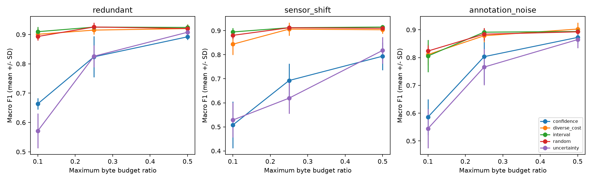

# 感知数据选择、通信网络与 A2A 综合模拟报告

项目：基于多模态机器狗的通感算控一体化平台搭建。
生成时间：2026-10-04 17:46（香港时区）；所有数字来自当前结果文件。

## 1. 当前结论

学长提出的基础资料、ROS接口、通信与计算约束下的感知数据选择、网络通信和A2A，已在本机完成本阶段调研与模拟验收。新增480次公开图像试验、3组代理目标精确求解、7组独立容器网络测试、真实接收数据训练，以及两个独立A2A进程的11项协作/持久化检查。
这不是设备验证或论文最优性证明。没有实物的条件下，设备型号、载板与JetPack只能保留为工作假设；模拟数据、代理价值和资源参数都不代表机器人真实环境。

主要发现：较简单的随机/间隔抽样在当前公开图像试验中具有较好的效果与较低的选择开销；置信度或不确定性单独排序均可能明显退化。可靠传输能送达数据，但不能保证数据仍然新鲜。A2A适合组织任务、结果与恢复查询，不是直接替代高频感知数据流的协议。

## 2. 学长要求逐项落实

| 要求 | 本阶段完成证据 | 仍需设备或真实研究验证 |
|---|---|---|
| 宇树基础操作 | 核验7篇官方正文；接入与只读核查说明、模拟档案校验 | 接线、SSH、设备服务/传感器操作 |
| Orin NX背景 | NX拓展坞/JetPack5.1.1工作假设，备选6.2档案，版本与IP负例检查 | 真实容量、载板、镜像、ARM/GPU速度/功耗 |
| ROS1更多、ROS2也会用 | 首阶段ROS1/ROS2接口与QoS；本阶段ROS1跨独立容器通信 | 原生宇树DDS/SDK接入与ROS1适配桥 |
| 通信/计算约束下选取有价值感知结果 | 实际字节预算、固定学习工作量、5种策略、3场景、5种子；精确代理目标对照 | 真实感知任务和代价模型；训练最优性 |
| 网络与A2A | IP/TCP/UDP职责，容器网络、netem与抓包；真实A2A双服务委托/恢复 | 真实无线、跨机器、TLS/鉴权与进行中任务故障续跑 |

## 3. 系统结构


ROS1 Master、发送端和接收端运行在3个独立容器中，无宿主公开端口。图像训练运行在Windows专用虚拟环境；A2A协调和分析服务是两个独立Windows进程，以真实回环HTTP/TCP通信。这里不是3D动力学仿真器，也没有实现机器狗运动控制。

## 4. 设备基础资料结论

学长的 module_update 是拓展坞配置页面：包含NX/Orin模组、网络接入与版本恢复等说明；不是单一通信协议教程。结合其Go2 NX出厂镜像信息，本阶段采用“Go2 EDU + NX拓展坞 + JetPack5.1.1”的假设，同时保留其他机器狗/载板可能。

实机只读核查与操作顺序见 [宇树与Orin基础操作](宇树与Orin基础操作.md)。特别区分机器人内部电脑 `.161` 和Go2拓展坞 `.18`；不能把学长说ROS1更多推导成设备底层就是ROS1。官方SDK2/DDS与ROS2资料提示，ROS1可能需要另做类型/协议适配。首阶段通用Fast DDS演示不能作为宇树CycloneDDS接入证明。

## 5. 数据与公平对照

- 使用sklearn自带UCI digits：1797张8×8手写数字图像、10类；它是真实采集的公开图像，但不是机器人相机数据。
- 每种子先按源ID划分：300张公共warm start、450张测试图像、1047张流候选图像。1400条帧序列只从候选池重复抽取，重复概率0.65；源ID不跨训练/测试。
- 该划分不是书写者独立划分，也不证明真实视频时序泛化。模拟IMU只作为消息元数据，未参与多模态学习；额外载荷为人工变长字段，用来检验字节预算。
- 3场景：重复帧；训练流/测试图像同做1像素横向平移的感知失配；只在流标注中以20%概率加入错误标签。
- 教师LogisticRegression仅用warm start训练，输出感知预测与概率；筛选函数只接收消息、像素、字节成本，不接收标签或测试集。
- 接收学习器SGDClassifier(log_loss)，各策略相同600个warm start样本处理；额外学习工作预算分别800/2400个样本处理，batch40且重复采样。
- 每100条消息一个字节窗口，预算比例10%/25%/50%；成本为4字节长度头+UTF8 JSON+每帧5字节模拟标注代价。
- 模拟标签查表在网络接收之后提供；没有实现真实标注服务，5字节是明确统一假设，不能理解成真实标注系统完整成本。
- 5种策略×3预算×2学习预算×3场景×5种子=450组；另30组全量参考，共480组。全量参考不受相同发送预算约束，也不是最优上界。

计算约束以确定的学习工作量执行，不等价于限制总CPU秒数：教师预测、选择、训练耗时分别记录，复杂选择本身可能不划算。首阶段50ms墙钟限制仍为batch间检查的软限制；本阶段没有追加硬实时保证。

## 6. 图像试验结果

以下为25%字节预算、2400个额外学习样本处理、5种子均值±标准差；选择耗时为整个1400帧流的毫秒均值，不是单帧时延。

| 场景 | 策略 | Macro F1均值±SD | 平均保留帧 | 选择耗时ms |
|---|---|---:|---:|---:|
| 标注噪声 | 高置信度 | 80.32% ± 9.83 | 348.6 | 1.46 |
| 标注噪声 | 差异/成本候选 | 87.85% ± 2.34 | 428.2 | 9.57 |
| 标注噪声 | 固定间隔 | 89.14% ± 1.41 | 339.4 | 1.15 |
| 标注噪声 | 随机 | 88.41% ± 2.25 | 345.8 | 1.41 |
| 标注噪声 | 高不确定性 | 76.58% ± 6.52 | 344.0 | 1.39 |
| 重复帧 | 高置信度 | 82.39% ± 6.99 | 353.6 | 1.55 |
| 重复帧 | 差异/成本候选 | 91.50% ± 1.51 | 425.6 | 10.88 |
| 重复帧 | 固定间隔 | 92.52% ± 0.58 | 338.4 | 1.19 |
| 重复帧 | 随机 | 92.56% ± 1.46 | 350.0 | 1.60 |
| 重复帧 | 高不确定性 | 82.59% ± 3.73 | 344.8 | 1.46 |
| 感知失配 | 高置信度 | 69.26% ± 7.06 | 346.4 | 1.46 |
| 感知失配 | 差异/成本候选 | 90.64% ± 2.66 | 433.0 | 9.97 |
| 感知失配 | 固定间隔 | 91.22% ± 0.66 | 338.2 | 1.17 |
| 感知失配 | 随机 | 91.19% ± 1.07 | 349.8 | 1.45 |
| 感知失配 | 高不确定性 | 61.93% ± 6.43 | 346.8 | 1.41 |



同预算指相同发送上限，不要求各策略恰好花光预算。差异/成本候选倾向选择较短消息，因此保留帧数更多；其效果仍未稳定超过随机基线。固定学习工作量控制接收训练量，但保留池的类别覆盖与重复性仍会影响模型。

与随机策略的配对差（同种子，25%预算/2400工作量）：

| 场景 | 策略 | F1差值pp | 探索性95%区间pp |
|---|---|---:|---:|
| 标注噪声 | 高置信度 | -8.09 | [-20.71, +4.53] |
| 标注噪声 | 差异/成本候选 | -0.56 | [-3.35, +2.24] |
| 标注噪声 | 高不确定性 | -11.83 | [-18.31, -5.36] |
| 重复帧 | 高置信度 | -10.16 | [-20.11, -0.22] |
| 重复帧 | 差异/成本候选 | -1.05 | [-2.90, +0.79] |
| 重复帧 | 高不确定性 | -9.97 | [-15.15, -4.78] |
| 感知失配 | 高置信度 | -21.93 | [-30.43, -13.43] |
| 感知失配 | 差异/成本候选 | -0.55 | [-3.26, +2.15] |
| 感知失配 | 高不确定性 | -29.27 | [-36.60, -21.93] |

配对区间使用5种子t近似、未做多重比较修正，只作探索性展示。没有根据测试集重新调权重后宣称胜出；差异/成本候选的负结果保留。不同数据集上的策略排序变化说明，不能把“高置信度”或“高不确定性”当成固定训练价值。

原始结果：[逐次运行](结果/图像实验/runs.csv)、[汇总](结果/图像实验/summary.csv)、[逐窗口预算](结果/图像实验/window-budgets.csv)、[划分证据](结果/图像实验/split-manifest.json)、[配置](实验/image-config.json)。

## 7. 计算与内存

当前480组主体运行墙钟 54.75s，CPU时间 54.62s；按CPU时间/墙钟统计，平均约占用单个逻辑核的 99.77%。本机有 32 个逻辑核，这不是整台机器CPU利用率。进程峰值工作集 182.06MiB，包括解释器、数据与库，非GPU显存。

统计的是完整实验阶段的聚合CPU占用，避免将短任务Windows计时量化误当成精确CPU时延。CSV/绘图输出不计入该墙钟区间，内存峰值采样在结果整理阶段。容器CPU/内存上限是测试隔离参数，不是Orin NX的性能模拟。

## 8. “最优值”如何界定

真实研究问题可写为：在每窗口字节预算、计算预算和样本年龄约束下，选择集合S，使后续网络在独立数据上的学习效果最好。这个效果是训练过程的结果，不能在发送端用测试标签提前求值。

本阶段候选使用感知熵、像素差异和消息字节成本作为启发式。另对14条消息定义可加的整数化熵代理价值，并做精确0/1背包；3个预算都与2^14穷举一致：

| 预算比例 | 预算字节 | 精确代理目标值 | 价值/成本贪心值 | 差距 |
|---|---:|---:|---:|---:|
| 10% | 771 | 2110 | 2110 | 0 |
| 25% | 1929 | 7450 | 6330 | 1120 |
| 50% | 3859 | 13778 | 13054 | 724 |

这只证明指定小规模、可加代理目标下的最优解；差异/成本候选本身是另一个非可加启发式，不能套用这个最优性结论。神经网络学习、分布失配、标注错误与非线性相互作用都未被代理目标精确表达。

## 9. 独立容器网络结果

实际在Linux网络命名空间间经Docker桥接传输，分别运行TCP、UDP和ROS1/TCPROS。netem在发送容器eth0出口配置基础25ms延迟、5ms抖动、12%随机包丢失、512kbit速率；不是Python随机跳过发送。规则在测试后移除。

每例最多120条已选择消息，新鲜度TTL为0.5s。消息新增发送时间字段后，重新核算JSON长度、标注假设和每窗口预算，避免时间戳开销使原选择超限。

本阶段TTL检查的是“接收时刻－发送时刻”，用来隔离传输、重试与积压造成的年龄；尚未包括真实传感器采集、前处理和筛选窗口等待的端到端样本年龄。不要把它写成完整采集至训练时限。

| 场景 | 发送 | 唯一到达 | 新鲜接受 | 过期 | 缺失 | 接收接口Ethernet字节 |
|---|---:|---:|---:|---:|---:|---:|
| tcp-normal | 120 | 120 | 120 | 0 | 0 | 78245 |
| tcp-netem | 120 | 120 | 116 | 4 | 0 | 80291 |
| tcp-reconnect | 120 | 120 | 120 | 0 | 0 | 79330 |
| udp-normal | 120 | 120 | 120 | 0 | 0 | 66289 |
| udp-netem | 120 | 109 | 109 | 0 | 11 | 60346 |
| ros1-normal | 120 | 120 | 120 | 0 | 0 | 80246 |
| ros1-netem | 120 | 120 | 81 | 39 | 0 | 69074 |

TCP重连场景实际业务重试 1 次，接收端去重 1 次；新鲜接受文件中没有重复训练条目。

TCP例程有逐消息应用确认与有限重试，UDP例程无应用重传，ROS1使用发布/订阅与队列；不同发送/确认方式不支持严格吞吐排名。可靠传输可能因重传/积压而过期，因此“到达”和“可用于训练”分别统计。

接口字节来自接收容器eth0上实际抓到的双向匹配IPv4 Ethernet帧，计入捕获到的IP/TCP/UDP头、ACK及重传；排除测试控制端口。ROS1口径还含该对端间XMLRPC/TCPROS连接流量。没有Ethernet FCS、无线MAC重传或实际PHY开销，不能称为全部无线字节量。

netem出口测试用来验证故障机制，并非真实TCP性能标定；其计时粒度与TCP Small Queues等机制会影响结果，手册建议真实性能测试考虑接收端入口配置。随机丢包与调度可能改变重跑计数，不要求每次恰好缺失同样的序号。[netem手册](https://man7.org/linux/man-pages/man8/tc-netem.8.html)

网络环境共享Docker Desktop内核与时钟；没有验证真实跨设备时钟同步、天线/射频、信道干扰或移动链路。

## 10. 用实际接受的数据训练

| 场景 | 实际接受帧 | Macro F1 |
|---|---:|---:|
| tcp-normal | 120 | 87.24% |
| tcp-netem | 116 | 88.57% |
| tcp-reconnect | 120 | 87.24% |
| udp-normal | 120 | 87.24% |
| udp-netem | 109 | 86.72% |
| ros1-normal | 120 | 87.24% |
| ros1-netem | 81 | 83.32% |

同一warm start基线为 85.09%，正常接收120条后为 87.24%，在该固定模型与输入下提高 2.15pp。各例额外学习工作量均2400，标签按接受帧序号离线查表提供。

这证明网络接受文件确实进入了训练，且正常协议路径给出相同数据和结果；不能从单次受损样本集合F1的上下波动推导“丢包有益”或协议优劣。模型训练在Windows完成，不是在Jetson或ROS回调线程内进行。

## 11. A2A如何接入研究

协调服务接收已知实验ID，经真实A2A SendMessage委托分析服务。分析服务读取实际接收与训练证据，返回F1、新鲜帧数、接口字节、证据哈希及限定的分析建议；它不重新选择测试集最佳策略，也不发送运动指令。

协议1.0、官方SDK 1.2.1；官方DatabaseTaskStore配SQLAlchemy/aiosqlite。已完成11项检查：发现、真实证据委托、重复业务结果复用、SSE客户端断线后GetTask取得完成结果、取消、非法实验ID失败、两个服务的完成任务进程重启恢复、重启后缓存复用、未知方法错误和仅2次唯一业务计算。

任务SQLite与业务结果SQLite分开：前者保存任务状态与artifact，后者按实验内容哈希避免重复业务计算。持久化测试实际终止并重新启动服务进程。

边界：验证了完成任务的重启查询，没有实现执行中的训练工作在进程崩溃后续跑；串行重复请求复用不等于分布式恰好一次执行保证。本机回环未测试TLS、用户鉴权或跨主机部署，不需LLM密钥。

## 12. 协议位置与实施判断

| 层次/用途 | 本阶段判断 |
|---|---|
| IP网络层 | 负责容器/未来设备的寻址与路由；与A2A的任务语义不同 |
| TCP/UDP传输 | 可靠字节流与数据报需结合时效、确认、丢弃/重试策略选择 |
| ROS1数据流 | 适合复用学长已有节点；注意互相可达与消息时间/队列，而不只是Master端口 |
| DDS/ROS2设备接口 | 依实际宇树类型、网卡和RMW适配；与ROS1的桥接尚未做 |
| A2A任务协作 | 管理分析/训练任务、结果与状态恢复，不直接承担每帧原始感知流 |
| MQTT/gRPC/Zenoh | 首阶段已比较角色，本阶段没有独立部署它们；暂不引入更多组件 |

对当前研究，先保留随机/间隔基线，明确数据价值、标注质量和计算预算，再评估新颖性/不确定性等候选是否值得额外开销。接收端应有TTL、去重、有限队列与明确的重试边界；这些机制比把某个协议名字直接当作解决方案更可验证。

## 13. 复现与审计

独立综合审计 24 项通过：数据划分、预算、工作量、选择重放、实际网络序号与TTL、独立PCAP解析、接收训练哈希、A2A证据与磁盘任务、官方资料哈希、环境保护和容器停止。

```powershell
Set-Location ./simulation
& .\下一阶段\复现下一阶段.ps1
```

默认复用本地官方正文快照；需要重新访问官方资料时加 `-RefreshOfficialDocs`。脚本会更新新阶段结果并据此重新生成本报告；数据固定种子结果应重现，计时/网络随机故障结果允许变化。只操作本项目服务，不全局清理Docker，不改现有Ubuntu。

环境清单：[实际版本](环境/environment-public.json)、[数据依赖](环境/requirements-data.lock.txt)、[A2A依赖](环境/requirements-a2a.lock.txt)。
当前新网络镜像ID：`sha256:0a1bb6d4d1d457c933e813619af903fa1f41fad71754326ef997138cd26e0eff`；节点脚本从项目只读挂载执行，实际镜像和配置已记录。物理设备部署版本仍未知。

## 14. 尚未完成的真实工作

1. 设备接线、实际基础操作、容量/载板/JetPack确认与原生宇树感知接口适配。
2. 真实相机/点云/IMU数据、多模态融合模型、有效标注代价，以及实际训练效果和算法最优性。
3. 真实跨机器/无线、ARM/GPU/功耗、完整无线包量与设备时钟同步。
4. ROS1/ROS2原生类型桥、TLS/鉴权、正在执行的工作崩溃后恢复。

这些事项不具备当前实物条件，不作为本阶段必须实现的模拟验收；也不把它们写成已经完成。公开调研摘要、代码和实验结果；日志、抓包、数据库不上传。

详细参考资料见 [资料索引](资料索引.md)。
