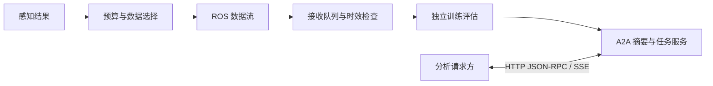

# 网络与智能体通信调研

> 首阶段历史材料。后续网络故障、A2A持久化与恢复验证以[最新综合报告](扩展调研与模拟/综合模拟报告.md)为准。

项目：基于多模态机器狗的通感算控一体化平台搭建。核验日期：2026-10-04。

本轮把“感知数据是否值得传递”和“模块、智能体怎样互通”分开研究。前者需要数据选择算法及通信/计算预算；后者需要消息契约、中间件、任务协议和实际网络。学长提到 A2A，为高层协作提供了明确的补充方向；严格按协议分层，A2A 属于应用层，不是 IP 网络层协议。[A2A 官方介绍](https://a2a-protocol.org/latest/topics/what-is-a2a/)

## 1. 协议分别解决什么问题

| 职责 | 代表机制 | 本项目需要关心的内容 | 本轮证据 |
|---|---|---|---|
| 网络层 | IPv4/IPv6 | 地址、路由、子网、MTU、跨网段可达性 | 调研；没有修改本机路由或进行跨网段实验 |
| 传输层 | TCP/UDP | 连接、顺序、重传、拥塞与应用消息边界 | 调研；ROS1/A2A 实际走本机 TCP，未单独做 TCP/UDP 性能排名 |
| 机器人消息通信 | ROS1 TCPROS；ROS2 RMW/DDS | topic/type、序列化、发现、队列、QoS | ROS1 四进程五场景；ROS2 DDS/QoS 对照 |
| 智能体任务协作 | A2A | 能力发现、任务 ID、进度、结果、取消 | SDK 1.2.1 / 协议 1.0 / JSON-RPC+SSE 实际演示 |
| 数据价值策略 | 抽样、不确定性、新颖性 | 选择哪些数据、预算是否超限、训练是否改善 | 360 次合成数据实验；它不是由通信协议自动提供的能力 |

IP 处理分组与寻址/转发相关问题，TCP 和 UDP 位于其上；应用协议再依赖这些基础设施。地址可达并不意味着服务端口或 ROS 发现必然可用。[IPv6 标准 RFC 8200](https://www.rfc-editor.org/rfc/rfc8200.html)

TCP 提供有序的可靠字节流，需要应用自行定义消息边界；成功收到字节不能直接保证数据仍新鲜、业务任务已执行或训练有效。UDP 自身不提供同样的可靠性或拥塞控制；应用需设计序号、时限、必要恢复和流量控制，不能仅凭“UDP”断言一定更快。[TCP 标准 RFC 9293](https://www.rfc-editor.org/rfc/rfc9293.html)、[UDP 使用准则 RFC 8085](https://www.rfc-editor.org/rfc/rfc8085.html)

本轮的带宽约束是“每窗口序列化载荷预算”，不是实际网卡带宽；主动丢弃是应用事件，不是 IP/TCP 包丢失。真正验证网络层需要独立的跨设备可达性、路由、MTU、抓包和受控链路实验，本轮没有这些证据。

## 2. ROS1 与 ROS2 的职责边界

ROS1 演示采用 `std_msgs/String` 包装 JSON，source、selector、receiver、logger 是独立进程；topic 的真实传输是 TCPROS。发送与订阅端有队列，业务又有有界接收队列与 TTL，因此需要分别记录预算筛除、传输到达、排队丢弃和过期。不能把所有接收缺失都称为无线丢包，也不能把 DDS QoS 套给 ROS1。[本轮核对的 ROS1 TCPROS 源码](https://github.com/ros/ros_comm/blob/30483a9f218f1545eec16d3934bf3cb042e2cb5b/clients/rospy/src/rospy/impl/tcpros_pubsub.py)

ROS2 通过 RMW 使用中间件，DDS 是重要实现路线。QoS 的可靠性、历史、深度、持久性等需要发布和订阅双方兼容。实际 Humble/Fast DDS 对照中，可靠配可靠、尽力配尽力能接收；尽力发布配可靠订阅收到不兼容事件，消息数为零。[ROS2 DDS 设计](https://design.ros2.org/articles/ros_on_dds.html)、[固定提交的 Humble QoS 官方说明](https://github.com/ros2/ros2_documentation/blob/8fdd73068e49efa23f6310f10d02c92c86442601/source/Concepts/Intermediate/About-Quality-of-Service-Settings.rst)

上述实测验证了兼容规则，没有比较 ROS1/ROS2 的无线吞吐或端到端性能。ROS1 使用新采集的单调时钟，ROS2 对照保留合成时间字段且不做 TTL 判断；消息契约相同，但不是完全相同的时间载荷。共同预算按 `4+UTF8 JSON` 统计，ROS2 另外记录实际 CDR 序列化大小；都没有把它冒充线上全部字节。

## 3. A2A 是怎样工作的

Agent Card 声明服务名称、能力、技能、接口和版本。客户端先访问 `/.well-known/agent-card.json`，根据接口声明选择协议绑定。本轮只使用回环地址上的临时端口，没有公开服务。[官方能力发现说明](https://a2a-protocol.org/latest/topics/agent-discovery/)

本轮服务把一段合成感知结果转换为预测类别计数、平均置信度和规则型策略提示。输入的 `prediction` 是感知模型输出，不能作为真实类别。服务不需要 LLM，不会移动机器狗，也不会自动找到“最优数据”。

交互用 `messageId` 标识消息，`contextId` 关联上下文，`taskId` 标识任务，artifact 标识返回产物。任务可以工作、完成或取消；本轮实际运行了这些状态，任务只保存在进程内存中。[官方任务生命周期](https://a2a-protocol.org/latest/topics/life-of-a-task/)

本轮采用协议 1.0 的 `SendMessage`、`GetTask`、`SendStreamingMessage`、`CancelTask`，流式反馈走 SSE。A2A 还定义 HTTP+JSON/REST、gRPC 等绑定；这里只验证 JSON-RPC，不宣称所有绑定都已测试。[A2A 规范](https://a2a-protocol.org/latest/specification/)

安装的是官方 Python SDK 1.2.1。其 protobuf 类型、`a2a.server.routes` 与旧版 Pydantic / `a2a.server.apps` 示例不兼容；`Part.data` 是 protobuf Value，应显式转换。版本以本机锁定依赖为准，不能把网上 main 分支示例无条件套进本地环境。[官方 SDK v1.2.1](https://github.com/a2aproject/a2a-python/tree/v1.2.1)

实际检查通过：发现、发送任务、查询完成任务、流式 working/completed、结构化结果、取消，以及未知方法/不存在任务的错误响应。未验证 TLS/鉴权、断线恢复、多副本持久化、跨网络部署。本轮同步请求含主动注入的150ms工作等待，总耗时见结果/A2A/summary.json，不能当作A2A协议本身的时延。

## 4. 其他候选协议应放在哪里

| 候选 | 有依据的能力 | 对本项目的候选用途 | 当前状态 |
|---|---|---|---|
| gRPC | 服务定义、类型化 RPC，以及流式调用 | 自定义边缘推理/训练服务接口；A2A 也可选相应绑定 | 仅调研，未安装/测试独立 gRPC 服务 |
| MQTT 5 | broker 发布订阅与 QoS 0/1/2 | 低频设备状态、遥测、告警；应用仍需去重和业务处理语义 | 仅调研，未搭 broker |
| Zenoh ROS2 DDS bridge | 桥接 ROS2 接口与 Zenoh 网络，配置桥接连接 | 跨设备、发现受限网络的候选桥接路线 | 仅调研，未装桥；需要另核对版本/网络配置 |
| rmw_zenoh | ROS2 的 Zenoh RMW 实现 | 支持版本中的中间件候选，不能当作所有 Humble 镜像默认可用 | 仅调研，本轮实际 RMW 是 rmw_fastrtps_cpp |

上述用途是项目架构推断，不是已验证的选型结果。依据分别为 [gRPC 官方介绍](https://grpc.io/docs/what-is-grpc/introduction/)、[OASIS MQTT 5.0 标准](https://docs.oasis-open.org/mqtt/mqtt/v5.0/os/mqtt-v5.0-os.html)、[Zenoh ROS2 DDS bridge 官方仓库](https://github.com/eclipse-zenoh/zenoh-plugin-ros2dds)、[rmw_zenoh 官方仓库](https://github.com/ros2/rmw_zenoh)。

## 5. 对机器狗平台的建议

当前可以保留三条明确职责：ROS 承载感知和设备消息；数据选择模块在发送前约束字节和计算开销；A2A 承载“分析这段数据、返回结果、查询进度”之类任务。先比较间隔/随机基线，再考虑学习型或新颖性策略，不预设高置信度最好。

对实际 Orin NX 平台，JetPack/ROS 版本仍是待实测配置；目前只按兼容背景模拟。后续设备接入时应先记录实际系统与接口，再核对设备间地址和时钟、消息类型、端口/发现、队列与预算。若需要 ROS1/ROS2 共存桥接，应单独设计和验证，当前没有安装 ros1_bridge。

最终架构判断是：A2A 可作为高层任务协作补充，但本轮没有证据支持它替代高频 ROS 感知数据流；数据价值优化需要算法和实测指标，不能靠换一个协议名称完成。

