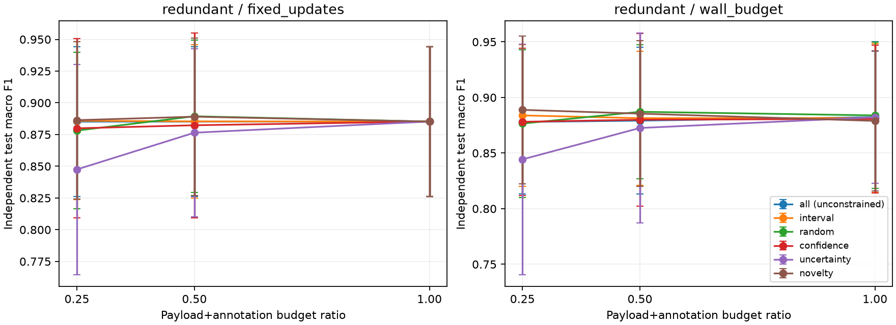
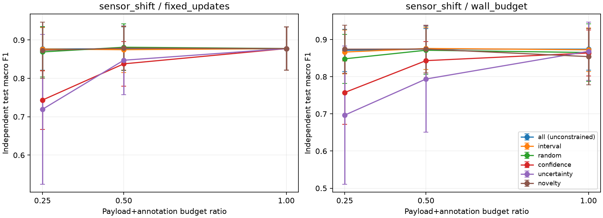

# 本地模拟实验与通信架构阶段报告

> 首阶段历史材料。后续网络故障、A2A持久化与恢复验证以[最新综合报告](扩展调研与模拟/综合模拟报告.md)为准。

**项目：** 基于多模态机器狗的通感算控一体化平台搭建。**完成日期：** 2026-10-04。

本轮完成本地数据选择实验、ROS1 四进程消息链路及异常验证、A2A 实际 HTTP/SSE 任务演示、网络协议调研，并补做 ROS2 Humble QoS 对照。成果已整理为公开版本，日志及原始协议输出仍留在本地。

## 1. 本轮结论

1. **减少传输不必然降低学习效果，但要用基线证明。** 在两种合成场景的25%预算下，固定间隔分别节省 75.48% / 75.55% 的载荷及模拟标注字节，宏平均F1为 88.59% / 87.63%。这些结果接近本实验的全量参考，不能外推为真实机器狗性能。
2. **高置信度不等于训练价值高。** 感知模型失配场景中，高置信度筛选F1为 74.35%，随机抽样为 86.89%，本组均值相差 12.54 个百分点。不确定性筛选也可能偏置，不预设它一定改善训练。
3. **筛选计算开销不能忽略。** 正常场景中新颖性筛选约 14.63ms，随机约 0.58ms；相同更新次数下，新颖性仅比随机高 0.82 个F1百分点。在50ms墙钟约束下，新颖性平均可训练 24.8 次，随机 38.8 次。应一起评估选择开销和训练收益。
4. **可靠到达与业务有效不同。** ROS1 正常场景42条选中消息全部到达；慢接收和人工延迟时，数据仍到达却因队列满或过期不能用于训练。预算筛除、注入丢弃、传输缺失和业务过期须分别统计。
5. **A2A适合高层任务协作；ROS负责感知消息流。** 本地已验证任务发现、查询、流式状态、结果与取消；A2A不是IP网络层协议，不能自动完成数据价值优化。协议分层依据见 [网络调研](网络调研.md)，而非由本地速度测量推断。

## 2. 假设、环境与可复现设计

学长提供 Orin NX 背景以及 ROS1 更多的反馈；真实模组容量、载板与 JetPack 镜像仍未实测。JetPack5.x/Ubuntu20.04/Noetic仅作为兼容背景。本轮实际运行在 Windows x86-64 Python3.13.9 与 Docker 的 Noetic/Humble 容器，没有安装 Jetson ARM 固件或 CUDA。

数据源：每种场景每种子1500条8维特征；约70%概率形成近重复观测。使用独立240条样本训练感知预测器。redundant场景分布一致；sensor_shift给特征坐标施加固定偏移，让源端感知器失配。各自独立生成1000条测试样本；没有以测试集调参。

配置：种子11/23/37/51/71；窗口100条；字节预算25%/50%/100%；六种策略；固定50次mini-batch更新或50ms墙钟计算约束。每batch40条，固定更新模式共2000次样本处理。合计360次试验。模型为SGDClassifier(log_loss, alpha=.001, eta0=.03, constant learning rate)。

所有策略共用同一窗口字节上限，实际消耗因消息大小和采样规则略有不同，不能称为完全相同的发送字节。选择器不读取真值；监督训练用独立标签映射，每条模拟标注uint32序号+uint8标签共5字节计入预算。完美标注是简化假设，不含真实人工标注代价。

计算预算含本流感知预测、选择和训练墙钟时间，不含共同的数据生成/JSON序列化与独立测试评估。每batch之间检查时限，因此是软预算，不是硬实时保证。真实特征计算、标注成本、操作系统调度与异构硬件会改变结论。

数据实验总运行约 23.75s；Windows进程峰值工作集约 178.60MiB（含解释器/库）。最大50ms软预算超时 22.560ms。内存不是Jetson/GPU测量，耗时不是CPU占用率。

固定间隔、随机和价值策略都受预算约束。全量是未限传输的参考，不是算法最优上界；它在25%/50%预算下会超预算，不参与同预算优劣宣称。

## 3. 25%预算下的固定更新结果

表内F1为5种子均值±样本标准差，单位为%；标准差描述这五种子的波动，不是置信区间。

### 分布一致/近重复

| 策略 | 测试宏F1（%） | 字节节省（%） | 选择耗时（ms） |
|---|---:|---:|---:|
| 全量参考（可超预算） | 88.52 ± 5.90 | 0.00 | 0.583 |
| 固定间隔 | 88.59 ± 6.21 | 75.48 | 0.229 |
| 随机 | 87.81 ± 6.16 | 75.23 | 0.582 |
| 高置信度 | 87.99 ± 7.07 | 75.27 | 0.674 |
| 不确定性 | 84.75 ± 8.28 | 75.32 | 0.723 |
| 新颖性 | 88.63 ± 6.20 | 75.24 | 14.626 |

### 感知模型失配

| 策略 | 测试宏F1（%） | 字节节省（%） | 选择耗时（ms） |
|---|---:|---:|---:|
| 全量参考（可超预算） | 87.77 ± 5.67 | 0.00 | 0.553 |
| 固定间隔 | 87.63 ± 5.58 | 75.55 | 0.224 |
| 随机 | 86.89 ± 6.57 | 75.24 | 0.555 |
| 高置信度 | 74.35 ± 7.63 | 75.26 | 0.675 |
| 不确定性 | 71.94 ± 19.51 | 75.39 | 0.785 |
| 新颖性 | 87.33 ± 7.35 | 75.21 | 15.236 |

完整25%/50%/100%结果与计算约束见 [汇总CSV](结果/数据实验/summary.csv)、[逐试验CSV](结果/数据实验/runs.csv)、[逐窗口预算](结果/数据实验/window-budgets.csv)。

另按同种子相对随机基线计算配对差及探索性95% t区间（n=5，未做多重比较校正），见 [配对差](结果/数据实验/paired-deltas.csv)。样本少且合成分布有限，不据小幅均值差宣布普遍最优策略。本组结果支持把间隔/随机当作低成本基线，而不支持淘汰简单基线。

## 4. ROS1实际链路与异常结果

source→selector→receiver及logger是四个独立ROS1进程。每窗口15条，60Hz源流；预算按String长度前缀4字节+JSON计算，不含线上TCP/IP或连接开销。选择器按低置信度排序，仅用来演示预算流，不把它当作数据实验中的最终优选方案。

| 场景 | 候选 | 选中 | 注入丢弃 | 到达 | 队列丢弃 | 过期 | 接受 |
|---|---:|---:|---:|---:|---:|---:|---:|
| normal | 90 | 42 | 0 | 42 | 0 | 0 | 42 |
| pause | 90 | 42 | 0 | 42 | 0 | 0 | 42 |
| slow_receiver | 90 | 90 | 0 | 90 | 69 | 19 | 2 |
| injected_delay | 60 | 28 | 0 | 28 | 0 | 28 | 0 |
| injected_loss | 90 | 42 | 16 | 26 | 0 | 0 | 26 |

暂停配置0.7s，记录到1次超过350ms的断流。慢接收处理80ms/条、业务队列容量4、TTL150ms；延迟场景在应用层等待60ms/条、TTL100ms；丢弃场景概率35%，固定随机种子实际丢弃16/42。不同场景参数不同，不能用于无条件协议性能对比。

五个场景均检查源、选择、转发、接收和各丢弃原因的序号守恒；无预算违约，无无法解释的接收缺失。延迟和丢弃为软件注入，不是无线包丢失、物理层仿真或拥塞控制测量。结果见 [ROS1汇总](结果/ROS1/summary.json)。

接收文件在Windows进程内独立训练（最多30次更新），不阻塞ROS回调；正常场景接收 42 条，测试F1为 80.16%。慢接收只有 2 条，状态为 offline training passed；所有场景的类覆盖、训练/测试损失另列CSV。没有新鲜数据时明确跳过训练，不伪造指标。真实接收数据规模很小，这只证明链路能接入训练，不能把异常场景F1排名当可靠结论。见 [接收数据训练](结果/ROS1/receiver-training.csv)。

## 5. ROS2对照与A2A演示

ROS2实际使用Ubuntu22.04/Humble、rmw_fastrtps_cpp，独立域47且只回环。相同特征/消息契约与应用字节口径下，90条候选选中42条并收到42条，选中序号与ROS1正常场景相同。CDR实际序列化合计 8225 字节，仅作序列化大小记录，不是完整网络包量。ROS2保留合成时间，未开展TTL/延迟比较。

可靠发布→可靠订阅、尽力发布→尽力订阅均收到消息；尽力发布→可靠订阅收到RELIABILITY不兼容事件且为零消息，符合 [Humble官方QoS兼容规则](https://github.com/ros2/ros2_documentation/blob/8fdd73068e49efa23f6310f10d02c92c86442601/source/Concepts/Intermediate/About-Quality-of-Service-Settings.rst)。这不等于两类可靠性在无线网中的优劣。ROS2三节点在同一进程，ROS1四进程，禁止据此比较吞吐。见 [ROS2结果](结果/ROS2/summary.json)。

A2A协议1.0 / SDK1.2.1，真实回环HTTP/TCP与SSE，输入20条感知结果。实际通过发现、SendMessage、GetTask、working/completed流式状态、结构化artifact、取消、未知方法与不存在任务错误。同步请求耗时约 162.56ms，其中主动等待150ms，不能当协议基准。任务服务无需LLM，摘要是预测统计而非真实类别；临时服务测试后关闭。

A2A采用官方SDK的任务/路由实现，角色和状态职责依据 [官方任务生命周期](https://a2a-protocol.org/latest/topics/life-of-a-task/)。本轮没有跨设备、TLS/鉴权、持久化任务、多副本、断线恢复或gRPC绑定测试。证据见 [A2A汇总](结果/A2A/summary.json)、[任务请求及结果](结果/A2A/summary.json)、[流事件](结果/A2A/summary.json)。

## 6. 对平台搭建的最终判断

当前有证据支持的路线是：先让ROS感知链路可追踪，再把字节窗口、时间戳、队列、过期和训练评估统一起来；用间隔/随机基线检查数据选择的净收益。固定窗口带来等待延迟，挑选更复杂还会消耗计算预算，必须共同报告。

高层可以用A2A发起数据摘要、训练分析等任务，任务结果进入决策/管理流程；不能把任务协议当成实时运动控制替代品，也不能把A2A称为IP网络层。IP/TCP/UDP、ROS/DDS与A2A的职责和候选MQTT/gRPC/Zenoh路线详见 [网络调研](网络调研.md)。这些候选仅调研，没有宣称全部部署。

**本轮没有找到或证明最优选择算法。** 数据与完美标签、固定偏移失配、小模型、5种子和本机计算都是边界；不存在对学长论文算法的复现或实机性能保证。实机下一阶段需要实际配置/真实数据、链路测量与更广的数据分布，才可判断能否提升网络训练效果。

## 7. 交付与复现

源码、配置、逐试验数据、图表、接口表、资料索引与复现脚本已保存；日志仅本地。基础环境之外的新增为专用ROS2镜像/容器/卷，不改其他项目。运行结束只停止本项目容器。

- [一键复现实验](复现实验.ps1) / [项目入口](README.md)
- [模块接口与统计口径](模块接口.md) / [环境与版本](环境/环境说明.md)
- [独立结果审计](结果/audit.json) / [资料证据索引](资料索引.md)

结果审计检查360次唯一试验、预算、更新次数、全预算策略等价、配置哈希、JSON实际字节、独立标签与测试、ROS1/ROS2序号一致和A2A真实产物。审计不等于第三方复现实验，墙钟结果重跑可变化。当前已完成计划中的本地交付；实机验证不属于这轮已完成内容。
