# 面向多模态机器狗的单智能体模块通信机制调研

**项目：** 基于多模态机器狗的通感算控一体化平台搭建

**调研主题：** 单智能体模块接口、消息格式、数据传输机制与多智能体扩展

**文献及开源资料核查日期：** 2026-09-27

**调研性质：** 文献、官方文档与开源代码调研；**未进行实验室设备连接、实机通信或性能实测**。

> **项目信息确认状态：** 采用宇树科技机器狗、搭载 NVIDIA Jetson，软件按 ROS 2 方向建设。具体机器狗型号、Jetson 型号、Ubuntu/ROS 2 发行版、机载传感器及网络拓扑尚待学长确认。下文以 **Unitree Go2 + Jetson + ROS 2** 为具象化参考案例，不将其写成已验证的实际配置。

## 摘要

本次调研针对多模态机器狗通感算控一体化平台的通信需求，首先将系统抽象为传感采集、状态估计/感知融合、智能体决策与规划、运动控制、状态监控五类模块，分析各类模块的通信接口及信息流。其次梳理 ROS 2 的 Topic、Service、Action，以及 `.msg`、`.srv`、`.action` 消息描述机制，结合宇树官方 `unitree_ros2` 与 `unitree_sdk2_python` 项目核对真实的机器狗状态消息、SDK2 的发布订阅与运动服务接口。随后介绍 ROS 2—RMW—DDS/RTPS—网络传输之间的关系，讨论多模态数据在时延、吞吐量、新鲜度、可靠性和安全方面的不同约束。最后提出单机优先、厂商接口适配、再按需求延伸到边缘计算与多机器狗协作的候选架构，并列出下一阶段需实测及确认的事项。

**阶段结论：** 若设备确实为支持 SDK2 的宇树平台且 ROS 2 为既定技术路线，可优先调查“ROS 2 上层模块接口 + 与机器狗适配的 Cyclone DDS/SDK2 通道”，使用 ROS 2 标准消息承载多模态数据，面向任务语义设计少量自定义接口；无线跨机链路可作为 Zenoh 等方案的后续评估对象。此处属于方案建议，不是已经完成的选型或实测结论。

---

## 阅读导航

- [范围与候选架构](#1-项目边界与通信需求)
- [模块接口](#2-单智能体模块接口ros-2-的通信模式)
- [消息格式](#3-消息格式标准类型厂商真实类型与自定义类型)
- [传输与 QoS](#4-数据传输机制与协议层次)
- [宇树源码调查](#5-宇树官方项目的代码调查)
- [论文与证据边界](#6-论文调研与对项目的启发)
- [本周总结](#8-本周总结与待向学长确认事项)

## 1. 项目边界与通信需求

### 1.1 “通感算控”的工程拆解

- **通（通信）**：传感数据、任务指令、机器人状态在机内与机外流动；负责接口约定、寻址发现、消息传递、质量管理。
- **感（感知）**：摄像头、激光雷达、IMU、里程计等数据采集与环境理解。传感器是否齐全，以实物为准。
- **算（计算）**：Jetson 等机载平台或外部工作站进行目标识别、数据融合、定位、路径规划、智能体推理。
- **控（控制）**：将高层运动目标交给运动服务/控制器执行，并获得运动状态、任务结果与错误信息。

项目名称中的“通感”还可能涉及无线通信领域的**通信感知一体化 ISAC**。这是否属于学长的研究范围，需要单独确认；本报告主要讨论机器人软件模块之间的信息通信，不预设已经涉及无线物理层联合感知设计。

### 1.2 候选架构与数据闭环

```mermaid
flowchart TD
  subgraph S["传感与机载设备"]
    CAM["RGB/深度摄像头"]
    LIDAR["激光雷达（如有）"]
    IMU["IMU/机体状态"]
  end
  CAM -->|Image/CompressedImage| P["感知与融合模块"]
  LIDAR -->|PointCloud2（如有）| P
  IMU -->|Imu/Odometry/厂商状态| EST["状态估计模块"]
  P -->|障碍物/目标语义信息| PLAN["任务决策与规划模块"]
  EST --> PLAN
  PLAN -->|目标速度/目标位姿/导航任务| ADAPTER["厂商接口适配层"]
  ADAPTER -->|厂商定义的高层接口| MOTOR["运动服务/机器狗控制器"]
  MOTOR -->|SportModeState/错误与状态| EST
  MOTOR -->|状态/执行结果| PLAN
  P -. 按需卸载 .-> EDGE["边缘工作站/服务器（可选）"]
  EDGE -. 计算结果 .-> PLAN
```



这里的 `ADAPTER` 是**建议设计的业务语义适配层**，不是断言宇树 SDK 内部已存在这个名字的组件。它可采用厂商 ROS 2 消息直接对接，也可调用 SDK2；两者是候选接入方式，不应让两个控制源同时下发指令。机器人底层关节高速控制通常由厂商控制系统承担；本周不建议直接接管底层电机控制。

### 1.3 初步数据分类

| 数据流 | 示例 | 数据特性 | 优先关注 |
|---|---|---|---|
| 原始图像 | RGB/深度图 | 容量大、周期产生 | 带宽、时延、队列深度 |
| 点云（如有） | 三维点集合 | 容量较大、坐标信息重要 | 带宽、坐标系、同步 |
| IMU/里程计 | 加速度、姿态、速度 | 高频、时效性强 | 时间戳、抖动、新鲜度 |
| 感知结果 | 类别、位置、置信度 | 较小但有语义依赖 | 坐标系、置信度、有效期 |
| 高层任务 | 到达目标、开始巡检 | 低频、需要反馈 | 确认、任务 ID、取消、超时 |
| 机体状态 | 运动模式、足端/电量 | 连续或事件触发 | 丢失检测、健康监测 |

---

## 2. 单智能体模块接口：ROS 2 的通信模式

ROS 2 以节点（Node）组织软件功能，以 ROS graph 表示节点与接口之间的关系；节点与进程并非一一对应，同一进程可包含多个节点。[1](https://github.com/ros2/ros2_documentation/blob/35b00f1f3c1ab7c14bf85e35fa895f9f580ea279/source/Concepts/Basic/About-Nodes.rst)

| 接口 | 语义 | 本项目候选用途 | 注意事项 |
|---|---|---|---|
| Topic | 发布—订阅、持续流式数据 | 图像、IMU、状态、障碍物列表 | 不自带“业务任务已完成”语义 |
| Service | 请求—响应、期望快速返回 | 查询某项状态、切换参数、短操作 | 不适合作为长时间导航任务的唯一接口 |
| Action | 提交目标、反馈进度、得到结果、可取消 | 前往目标点、执行巡检任务 | 必须由任务执行方实现或复用已有 Action server；不是厂商运动服务天然就具备 |

**接口映射草案（非现成设备 Topic 清单）：**

| 建议节点 | 输入 | 输出 | 候选接口 |
|---|---|---|---|
| `camera_node` | 摄像头 | `/camera/image_raw` | Topic `sensor_msgs/msg/Image` |
| `perception_node` | 图像/点云 | `/perception/objects` | Topic 自定义目标结果消息 |
| `state_node` | 厂商状态消息 | `/robot/state_summary` | Topic 自定义聚合状态消息 |
| `planner_node` | 感知+状态 | `/planner/cmd_vel` 或导航目标 | Topic / Action，依系统设计 |
| `unitree_adapter_node` | 上层运动请求 | 厂商 ROS 2 消息或 SDK2 高层接口；状态转发 | 应用适配层 |
| `mission_node` | 用户任务 | 任务状态/结果 | Action（建议） |

`/planner/cmd_vel` 仅是示例名称，并不意味着可以直接向厂商 Go2 发送标准 `geometry_msgs/Twist` 就使它运动；需要厂商接口适配与安全仲裁。[2](https://github.com/unitreerobotics/unitree_ros2/blob/668d1ec5a05d1c38d3306bdca7d59f2ba3581a88/README.md)[3](https://github.com/unitreerobotics/unitree_sdk2_python/blob/814556d15970dd2ecf1c9984e845ca02ab07e206/README.md)

## 3. 消息格式：标准类型、厂商真实类型与自定义类型

### 3.1 ROS 2 接口文件

`.msg` 定义字段及类型；`.srv` 的两个部分分别是请求和响应；`.action` 的三个部分为 Goal、Result、Feedback。[4](https://design.ros2.org/articles/legacy_interface_definition.html) 例如标准类型可考虑 `sensor_msgs/msg/Image`、`sensor_msgs/msg/Imu`、`sensor_msgs/msg/PointCloud2`、`geometry_msgs/msg/Twist`、`geometry_msgs/msg/PoseStamped`、`nav_msgs/msg/Odometry`。**使用标准消息时还应核对字段含义、单位和参考坐标系，而不是仅匹配数据类型。**

### 3.2 真实案例：宇树 `SportModeState.msg`

官方 `unitree_ros2` 仓库给出的消息包含下列字段（原定义节选，不是自编实验数据）：[5](https://github.com/unitreerobotics/unitree_ros2/blob/668d1ec5a05d1c38d3306bdca7d59f2ba3581a88/cyclonedds_ws/src/unitree/unitree_go/msg/SportModeState.msg)

```text
TimeSpec stamp
uint32 error_code
IMUState imu_state
uint8 mode
uint8 gait_type
float32[3] position
float32[3] velocity
float32 yaw_speed
float32[4] range_obstacle
int16[4] foot_force
float32[12] foot_position_body
```

以上是字段节选，省略的字段不能用于重建完整线格式。`TimeSpec` 也不是 `std_msgs/Header`，没有因此自动获得坐标系字段。分析如下：

- `stamp`：可以用于时间关联，但需核对它的时间基准以及是否与其他设备统一。
- `imu_state`：姿态/惯性状态。
- `mode`、`gait_type`：运动状态语义，不是仅有一串速度数字。
- `position`、`velocity`、`yaw_speed`：供状态估计、决策和监控使用；实际参考坐标系需查厂商文档。
- `range_obstacle`、`foot_force`、`foot_position_body`：体现机器人状态消息可同时包含环境/本体信息。

宇树 SDK2 C++ 代码中还有 `rt/sportmodestate`、`rt/lowstate`、`rt/lowcmd` 等真实 DDS 通道名称。[6](https://github.com/unitreerobotics/unitree_sdk2/blob/63096d0ac0c5d2dec9d6e0c22cd5233410ca2f36/include/unitree/dds_wrapper/robots/go2/go2_pub.h) 按 ROS 2 DDS 命名设计，ROS `/sportmodestate` 通常对应 DDS `rt/sportmodestate`；这是命名空间前缀映射，不是两个必须再建桥的独立主题。[16](https://design.ros2.org/articles/topic_and_service_names.html) 实际仍需核对当前固件、类型、Domain 和 QoS，不能对所有自定义 DDS 名称机械删除 `rt` 前缀。

### 3.3 面向本项目的候选自定义消息

假设感知模块要发布“发现的目标”，可设计一个概念草案：

```text
# DetectedObject.msg — 设计草案，尚未创建/编译
std_msgs/Header header
string robot_id
string object_id
string class_name
geometry_msgs/Point position
float32 confidence
```

本草案约定 `header.stamp` 保留输入观测的采集时间，处理完成时间另行记录，避免把旧观测包装成新数据；这不是 Header 自动保证的语义。`header.frame_id` 说明 `position` 所处的坐标系；如果要跨机器人共享，坐标变换、唯一 ID、时间同步和信息过期策略都必须补充定义。`confidence` 的含义应由感知算法说明，不能默认是概率校准值。

如需要跨机器人转发，建议明确消息版本、发出者标识、事件 ID、时间戳与 TTL（有效期）；这些属于**设计建议**，不是 ROS 2 自动提供的完整业务安全机制。

## 4. 数据传输机制与协议层次

```text
机器人业务模块：感知 / 规划 / 运动适配
          ↓
ROS 2 接口：Topic / Service / Action + msg/srv/action
          ↓
RMW（ROS Middleware 抽象）
          ↓
Cyclone DDS / Fast DDS 等具体 DDS 实现
          ↓
DDSI-RTPS（DDS 路线的线协议）
          ↓
UDP/IP 等传输与网络层（取决于实现/配置）
          ↓
以太网 / Wi-Fi 等实际网络
```

ROS 2 可使用多种 RMW 实现；DDS/RTPS 是重要但并非唯一的中间件路线，Zenoh 等方案亦存在。DDS 实现提供发现、序列化、可靠性及 QoS 等机制。[7](https://github.com/ros2/ros2_documentation/blob/35b00f1f3c1ab7c14bf85e35fa895f9f580ea279/source/Concepts/Intermediate/About-Different-Middleware-Vendors.rst) 这幅图表示 DDS 路线的典型跨进程/跨主机路径，不涵盖全部路径：进程内通信或支持共享内存的实现可能不经过网卡；ROS 2 本身不承诺每次消息传递都有固定网络时延。RTPS 的互通规范与 UDP/TCP 传输层不是同一层。[17](https://www.omg.org/spec/DDSI-RTPS/2.5/About-DDSI-RTPS)

| 名称 | 所在层级/职责 | 本项目讨论位置 |
|---|---|---|
| ROS 2 | 机器人软件开发与通信框架 | 单智能体模块协同基础 |
| DDS / Cyclone DDS | DDS 是中间件标准；Cyclone DDS 是其具体实现 | 与宇树 SDK2 对接的重点 |
| RTPS | DDS 的线协议（互通规范） | 理解 DDS 下层即可 |
| UDP/TCP | 网络传输层协议 | 分析链路特征；具体中间件可能有不同配置 |
| Zenoh | 分布式发布订阅/查询与跨网络通信 | 跨主机/多机器人备选评估；bridge 与 RMW 路线需区分 [10](https://github.com/eclipse-zenoh/zenoh-plugin-ros2dds/blob/d99c1b0ce24f0ec5bb238db2cf6485756fbf71e9/README.md)[18](https://github.com/ros2/rmw_zenoh) |
| MQTT | 基于代理的消息发布订阅 | 监控/遥测或跨网络服务备选 [21](https://mqtt.org/) |
| gRPC | RPC 服务通信框架 | 机载—服务器调用的备选 [22](https://grpc.io/docs/what-is-grpc/introduction/) |
| MCP/A2A | AI 工具接入/Agent 间任务协作 | **不是**电机实时通信的替代方案 [19](https://modelcontextprotocol.io/docs/2026-07-28/getting-started/intro)[20](https://a2a-protocol.org/latest/topics/what-is-a2a/) |

### 4.1 QoS 不是“越可靠越好”

ROS 2 QoS 包括 Reliability（Reliable/Best Effort）、History、Depth、Durability、Deadline、Lifespan、Liveliness 等策略；发布者/订阅者 QoS 兼容性不满足时，可能根本匹配不上。[8](https://github.com/ros2/ros2_documentation/blob/35b00f1f3c1ab7c14bf85e35fa895f9f580ea279/source/Concepts/Intermediate/About-Quality-of-Service-Settings.rst)

| 数据 | 候选思路 | 理由与限制 |
|---|---|---|
| 视频/部分高频传感器 | Best Effort、较浅队列（需实测） | 旧帧很快过期，避免堆积 |
| 关键任务状态 | Reliable + 应用层任务 ID/确认 | 需要跟踪是否完成，但 Reliable 不等于业务“恰好执行一次” |
| 位姿/速度控制参考 | 关注时间戳、deadline、短有效期与失联保护 | 过期的“完整收到”指令仍可能造成风险 |
| 静态配置/新加入者需要的状态 | 视需求评估 Durability | 不能未经实验直接宣称适用于所有数据 |

**关键区别：** 吞吐量是实际传输速率；端到端时延包含采集、排队、序列化、网络、计算和执行阶段；时延抖动是变化幅度；数据新鲜度关注“当前收到的消息实际有多旧”。

**避免误读 QoS：** `Depth` 主要配合 `Keep Last` 使用；`Deadline` 描述预期更新间隔并提供违约事件，不会自动急停，也不等于单条指令的有效期；`Lifespan` 约束消息过期，业务层仍要检查采集时间、控制权限和任务状态。[8](https://github.com/ros2/ros2_documentation/blob/35b00f1f3c1ab7c14bf85e35fa895f9f580ea279/source/Concepts/Intermediate/About-Quality-of-Service-Settings.rst) 例如仅考虑 Reliability 时，Best Effort 发布者不能满足 Reliable 订阅者；反向组合可兼容，但还需其他 QoS 同时兼容。

**序列化和传输的区别：** `.msg` 是接口描述，生成的语言对象经中间件序列化后才成为可传输字节，不能把 `.msg` 文本当作线上数据包。DDS 路线涉及 IDL 类型映射及 CDR 系列编码；具体字节布局、封装和兼容性取决于类型及实现，不能仅凭字段长度推导完整包长。[4](https://design.ros2.org/articles/legacy_interface_definition.html)[17](https://www.omg.org/spec/DDSI-RTPS/2.5/About-DDSI-RTPS) 发现先确定可通信的端点，随后才是数据交换；同名 Topic 仍需类型、Domain、QoS 和网络可达等条件配合。

### 4.2 一个可计算的带宽示例（纯估算）

假设 RGB 图像为 **1280 × 720、8 bit × 3 通道、30 fps、未经压缩**：

- 单帧数据量 ≈ 1280 × 720 × 3 = 2,764,800 byte ≈ 2.76 MB（十进制）。
- 纯载荷约 82.94 MB/s ≈ 663.6 Mb/s，**不含网络和消息封装开销**。

此数值是由假设计算的教学示例，**不是实验室机器狗码流、网络带宽或实测数据**。实际编码、分辨率、帧率、深度位数和链路条件会改变结果。该例说明为何跨 Wi-Fi 传输原始图像、压缩图像与目标检测结果具有不同网络成本。

## 5. 宇树官方项目的代码调查

| 资料 | 已验证用途 | 本次应读内容 |
|---|---|---|
| `unitreerobotics/unitree_ros2` [2](https://github.com/unitreerobotics/unitree_ros2/blob/668d1ec5a05d1c38d3306bdca7d59f2ba3581a88/README.md) | SDK2 与 ROS 2 支持和环境说明 | README、`unitree_go/msg/`、状态读取示例、Cyclone DDS 配置 |
| `unitreerobotics/unitree_sdk2_python` [3](https://github.com/unitreerobotics/unitree_sdk2_python/blob/814556d15970dd2ecf1c9984e845ca02ab07e206/README.md) | Python DDS 及高层 API 示例 | `example/helloworld/`、`unitree_sdk2py/core/channel.py`、`unitree_sdk2py/go2/sport/sport_client.py`（只读源码） |
| `unitree_sdk2py/core/channel.py` [9](https://github.com/unitreerobotics/unitree_sdk2_python/blob/814556d15970dd2ecf1c9984e845ca02ab07e206/unitree_sdk2py/core/channel.py) | 频道创建及发布/订阅逻辑 | `ChannelFactoryInitialize`、`ChannelPublisher`、`ChannelSubscriber` |
| `eclipse-zenoh/zenoh-plugin-ros2dds` [10](https://github.com/eclipse-zenoh/zenoh-plugin-ros2dds/blob/d99c1b0ce24f0ec5bb238db2cf6485756fbf71e9/README.md) | ROS 2 跨网络桥接和多机器人名称空间 | bridge 部署约束、每机器人独立 namespace |

### 5.1 两种接入方式及真实请求格式

**官方事实：** `unitree_ros2` 支持使用配套 ROS 2 消息直接与兼容平台通信，不要求每次再包装 Python SDK2；SDK2 则提供独立的客户端/发布订阅 API。[2](https://github.com/unitreerobotics/unitree_ros2/blob/668d1ec5a05d1c38d3306bdca7d59f2ba3581a88/README.md)[3](https://github.com/unitreerobotics/unitree_sdk2_python/blob/814556d15970dd2ecf1c9984e845ca02ab07e206/README.md) 本项目仍需要把任务语义映射到厂商接口，但“业务适配”不等于“必须加一道网络桥”。

官方 `unitree_api/msg/Request` 的字段如下：[13](https://github.com/unitreerobotics/unitree_ros2/blob/668d1ec5a05d1c38d3306bdca7d59f2ba3581a88/cyclonedds_ws/src/unitree/unitree_api/msg/Request.msg)

```text
RequestHeader header
string parameter
uint8[] binary
```

在核查版本中，ROS 2 `SportClient::Move` 将 `vx/vy/vyaw` 编为 JSON 的 `x/y/z` 参数，设置相应 API 标识后发布请求；这里的 `z` 参数代表转动速度输入，不能按普通三维线速度理解。[15](https://github.com/unitreerobotics/unitree_ros2/blob/668d1ec5a05d1c38d3306bdca7d59f2ba3581a88/example/src/src/common/ros2_sport_client.cpp) Python `SportClient.Move` 也编码 JSON，但使用 `_CallNoReply`，所以不能由它的返回值推断已收到远端业务确认，更不能推断完成移动。[14](https://github.com/unitreerobotics/unitree_sdk2_python/blob/814556d15970dd2ecf1c9984e845ca02ab07e206/unitree_sdk2py/go2/sport/sport_client.py) **这也表明强类型 ROS 消息和 JSON 参数可以共存。**

因此需区分：消息被发送 → 远端是否收到/接受 → 是否执行成功 → 目标是否达到。高层导航的成功判据、反馈和取消逻辑要由任务执行层定义，并结合机器人状态判断；DDS Reliable 不会自动补齐这些语义。

### 5.2 版本和文档偏差

截至本次核查，Python SDK README 仍列出 `example/high_level/read_highstate.py`，但对应固定提交的递归文件树中没有该文件。不得照抄为可运行命令。可先阅读 `unitree_ros2` 中实际存在的 `example/src/src/read_motion_state.cpp` 理解状态订阅；本次未运行任何厂商示例。源码定位和固定提交见 [资料索引](docs/资料索引.md)。

宇树官方 `unitree_ros2` README 将 Ubuntu 22.04 + ROS 2 Humble 列为其测试/推荐组合，同时列有旧版 Foxy 内容。[2](https://github.com/unitreerobotics/unitree_ros2/blob/668d1ec5a05d1c38d3306bdca7d59f2ba3581a88/README.md) **这不等于实验室 Jetson 上必然使用 Humble，也不代表适配任何 JetPack 版本；须核对设备当前系统、CPU 架构及厂商 SDK 版本后再安装。**

**安全边界：** 第一阶段仅阅读代码和只读订阅机器人状态。官方高层控制示例和低层 `lowcmd`/电机控制示例可导致实体运动，需由学长确认控制模式、急停、空间和权限后才能操作，且不要并发发送多个运动控制源。[3](https://github.com/unitreerobotics/unitree_sdk2_python/blob/814556d15970dd2ecf1c9984e845ca02ab07e206/README.md)

## 6. 论文调研与对项目的启发

**论文 A：** Macenski et al., “Robot Operating System 2: Design, architecture, and uses in the wild,” *Science Robotics*, 7(66), eabm6074, 2022, DOI: 10.1126/scirobotics.abm6074。[11](https://arxiv.org/abs/2211.07752) 研究了 ROS 2 的模块化、分布式软件架构与机器人应用。对本项目的启发是把模块边界、消息接口与通信需求作为平台搭建的第一步，而不是把所有算法耦合到一个程序中。

**论文 B：** Zhang et al., “Comparison of Middlewares in Edge-to-Edge and Edge-to-Cloud Communication for Distributed ROS 2 Systems,” *Journal of Intelligent & Robotic Systems*, 110, article 162, 2024, DOI: 10.1007/s10846-024-02187-z。[12](https://link.springer.com/article/10.1007/s10846-024-02187-z) 作者比较 DDS、MQTT、Zenoh 在以太网、Wi-Fi、4G 等配置下的时延和吞吐量，并在机器人运动任务中讨论影响。其报告的“有线条件下 Cyclone DDS、部分无线条件下 Zenoh 表现不同”应严格限定在论文测试条件内，**不能直接等同于本项目最佳协议选型**。

**本次阅读边界：** 论文 A 核验了作者预印本页面、摘要、期刊与 DOI 元数据；论文 B 核验了出版社页面、摘要、作者、发表年份、卷号与文章号。未逐表复算全文实验，也未复现；其试验配置和数字不得写成本项目证据。

结合两篇文献，本项目后续实验应采用相同机器、消息大小、发布频率、网络负载与测量方式对比，而不是只引用论文中的绝对数字。

## 7. 从单智能体到多智能体

单机先解决消息定义、模块耦合、时间戳、QoS 和失联保护；扩展到两台机器狗时增加：

1. **命名与身份：** `/robot1/...`、`/robot2/...`，避免同名 Topic 与任务 ID 冲突。
2. **坐标系与时钟：** 共享定位信息时区分各机器人 `map/odom/base_link`，建立跨机器人变换和时钟同步方法。
3. **数据边界：** 原始图像、特征或目标语义按任务选择共享范围，避免无意义地转发全部传感器流。
4. **发现与跨网络路由：** 局域网内先评估现有 DDS；跨 Wi-Fi 子网、边缘云或多机器人时可评估 Zenoh bridge。官方 Zenoh ROS 2 bridge 提供每机器人 namespace 的例子，并警告如果直接 DDS 与 bridge 路径同时连通可能出现重复/循环流量。[10](https://github.com/eclipse-zenoh/zenoh-plugin-ros2dds/blob/d99c1b0ce24f0ec5bb238db2cf6485756fbf71e9/README.md)
**实现提醒：** 节点使用绝对话题名时，简单增加节点 namespace 不会自动改写它；需要相对名、remap 或经过核验的桥接策略。`frame_id` 是消息内容，也不会因为 Topic 加了 namespace 就自动改写。[16](https://design.ros2.org/articles/topic_and_service_names.html)

5. **任务协商：** 如果是多个高层 AI Agent 协作，再研究任务分配、能力发现和 A2A/MCP 类机制；它们不代替 DDS 的低层状态通信。

## 8. 本周总结与待向学长确认事项

**已完成（资料调研层面）：** 形成单智能体模块通信架构；区分 Topic/Service/Action 与 `.msg/.srv/.action`；分析真实宇树状态消息；梳理 ROS 2—DDS—传输层及 QoS；建立对多智能体拓展的初步认识。

**请学长确认：** 机器狗型号和 SDK 代际；Jetson 型号和 JetPack/Ubuntu；ROS 2 发行版；各传感器连接方式；现有代码仓库；计划的单机任务；是否需要边缘计算/大模型；“通感”是否包含无线 ISAC。

**下周计划：** 确认机器狗及计算平台配置，梳理实际模块接口，并准备离线通信验证。

---

## 参考文献与开源资料

核验日期：2026-09-27。GitHub 核心证据固定到提交；动态官方页面以访问日为准，设备适配仍需按实际版本复核。详细证据边界见 [资料索引](docs/资料索引.md)。

- [1] [ROS 2 Humble 基本概念（官方源码）](https://github.com/ros2/ros2_documentation/blob/35b00f1f3c1ab7c14bf85e35fa895f9f580ea279/source/Concepts/Basic/About-Nodes.rst)
- [2] [Unitree ROS 2 README](https://github.com/unitreerobotics/unitree_ros2/blob/668d1ec5a05d1c38d3306bdca7d59f2ba3581a88/README.md)
- [3] [Unitree Python SDK2 README](https://github.com/unitreerobotics/unitree_sdk2_python/blob/814556d15970dd2ecf1c9984e845ca02ab07e206/README.md)
- [4] [ROS 2 msg/srv/action 定义](https://design.ros2.org/articles/legacy_interface_definition.html)
- [5] [SportModeState.msg](https://github.com/unitreerobotics/unitree_ros2/blob/668d1ec5a05d1c38d3306bdca7d59f2ba3581a88/cyclonedds_ws/src/unitree/unitree_go/msg/SportModeState.msg)
- [6] [Go2 DDS 通道源码](https://github.com/unitreerobotics/unitree_sdk2/blob/63096d0ac0c5d2dec9d6e0c22cd5233410ca2f36/include/unitree/dds_wrapper/robots/go2/go2_pub.h)
- [7] [ROS 2 Humble 中间件实现（官方源码）](https://github.com/ros2/ros2_documentation/blob/35b00f1f3c1ab7c14bf85e35fa895f9f580ea279/source/Concepts/Intermediate/About-Different-Middleware-Vendors.rst)
- [8] [ROS 2 Humble QoS（官方源码）](https://github.com/ros2/ros2_documentation/blob/35b00f1f3c1ab7c14bf85e35fa895f9f580ea279/source/Concepts/Intermediate/About-Quality-of-Service-Settings.rst)
- [9] [Python channel.py](https://github.com/unitreerobotics/unitree_sdk2_python/blob/814556d15970dd2ecf1c9984e845ca02ab07e206/unitree_sdk2py/core/channel.py)
- [10] [Zenoh ROS 2 DDS bridge README](https://github.com/eclipse-zenoh/zenoh-plugin-ros2dds/blob/d99c1b0ce24f0ec5bb238db2cf6485756fbf71e9/README.md)
- [11] [Macenski et al. 2022：作者预印本与期刊 DOI 元数据](https://arxiv.org/abs/2211.07752)
- [12] [Zhang et al. 2024：出版社摘要与书目信息](https://link.springer.com/article/10.1007/s10846-024-02187-z)
- [13] [Unitree Request.msg](https://github.com/unitreerobotics/unitree_ros2/blob/668d1ec5a05d1c38d3306bdca7d59f2ba3581a88/cyclonedds_ws/src/unitree/unitree_api/msg/Request.msg)
- [14] [Go2 Python SportClient](https://github.com/unitreerobotics/unitree_sdk2_python/blob/814556d15970dd2ecf1c9984e845ca02ab07e206/unitree_sdk2py/go2/sport/sport_client.py)
- [15] [ROS 2 SportClient 源码](https://github.com/unitreerobotics/unitree_ros2/blob/668d1ec5a05d1c38d3306bdca7d59f2ba3581a88/example/src/src/common/ros2_sport_client.cpp)
- [16] [ROS 2 话题到 DDS 名称映射](https://design.ros2.org/articles/topic_and_service_names.html)
- [17] [OMG DDSI-RTPS 2.5 标准页](https://www.omg.org/spec/DDSI-RTPS/2.5/About-DDSI-RTPS)
- [18] [ROS 2 rmw_zenoh 官方仓库](https://github.com/ros2/rmw_zenoh)
- [19] [MCP 官方介绍](https://modelcontextprotocol.io/docs/2026-07-28/getting-started/intro)
- [20] [A2A 官方介绍](https://a2a-protocol.org/latest/topics/what-is-a2a/)
- [21] [MQTT 官方介绍](https://mqtt.org/)
- [22] [gRPC 官方介绍](https://grpc.io/docs/what-is-grpc/introduction/)
